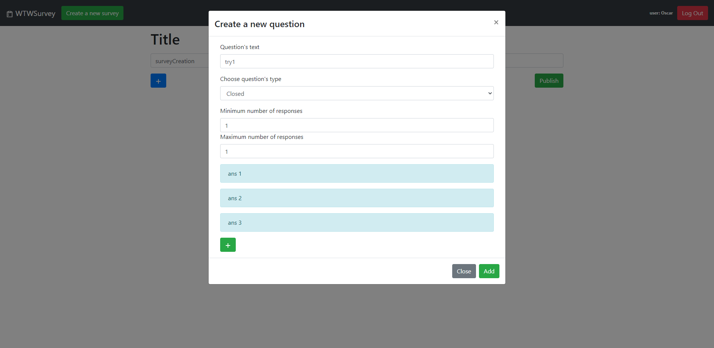

# Exam #1: "Survey"
## Student: s281759 Piccirillo Angelo Oscar 

## React Client Application Routes

- Route `/`: start page, with simply the navbar and the sideBar with list of surveys
- Route `/responses/:id`: (accessible only if logged in) shows the responses (if there are) to a specific survey, id is the identifier of the selected survey
- Route `/survey/:id`: (accessible only if not logged in) shows a specific survey and allows you to compile it, the id specifies the selected survey
- Route `/login`: (accessible only if not logged in) login page, allows you to log in by asking username and password
- Route `/createSurvey`: (accessible only if logged in) this page allows you to create a new survey by inserting questions and, for each of them, the answers

## API Server

- POST `/api/login`
  - Request body content: credentials of the user who is trying to login
  ``` JSON
  {
      "username": "username",
      "password": "password"
  }
  ```
  - response body content: the authentcated user
  ``` JSON
  {
      "id" : 1,
      "username": "admin@polito.it",
      "name": "Oscar"
  }
  ```
- DELETE `/api/logout/current`
  - Request body content: none
  - Response body content: none
- GET `/api/login/current`
  - Request body content: none
  - Response body content: authenticated user
  ``` JSON
  {
      "id": 1,
      "username": "admin@polito.it",
      "name": "Oscar"
  }
  ```
- GET `/api/getSurveys`
  - Request body content: none
  - Response body content: all surveys with relative questions
  ``` JSON
  [{
    "id": 1,
    "user": 2,
    "title": "Movies",
    "n_quest": 3,
    "n_ans": 21,
    "username": "Silvia",
    "questions": [{
        "id": 35,
        "test": "Which is your favorite kind of film?",
        "surveyId": 1,
        "min": 1,
        "max": 1,
        "type": "closed",
        "contentJSON": "[{\"text\":\"Horror\"},{\"text\":\"Yellow\"},{\"text\":\"Comedy\"},{\"text\":\"Thriller\"}]",
        "order": 1
    }, {
        "id": 36,
        "test": "Choose one or more film that you prefer",
        "surveyId": 1,
        "min": 1,
        "max": 4,
        "type": "closed",
        "contentJSON": "[{\"text\":\"2001: A Space Odyssey\"},{\"text\":\"A ClockWork Orange\"},{\"text\":\"Blade Runner\"},{\"text\":\"The Matrix\"}]",
        "order": 2
    }, {
        "id": 37,
        "test": "Why did you choose these films?",
        "surveyId": 1,
        "min": 0,
        "max": 0,
        "type": "open",
        "contentJSON": "\"\"",
        "order": 3
    }]
  }]
  ```
  (In this example I considered only one survey)
- GET `/api/getUserSurvey`
  - Request body content: none
  - Response body content: all the surveys of the current logged user (in the same format as above)
- POST `/api/createSurvey`
  - Request body: the survey that has to be created
  ``` JSON
  {
    "id": 1,
    "user": 2,
    "title": "Movies",
    "n_quest": 3,
    "n_ans": 0,
    "username": "Silvia",
    "questions": [{
        "test": "Which is your favorite kind of film?",
        "surveyId": 1,
        "min": 1,
        "max": 1,
        "type": "closed",
        "contentJSON": "[{\"text\":\"Horror\"},{\"text\":\"Yellow\"},{\"text\":\"Comedy\"},{\"text\":\"Thriller\"}]",
        "order": 1
    }, {
        "test": "Choose one or more film that you prefer",
        "surveyId": 1,
        "min": 1,
        "max": 4,
        "type": "closed",
        "contentJSON": "[{\"text\":\"2001: A Space Odyssey\"},{\"text\":\"A ClockWork Orange\"},{\"text\":\"Blade Runner\"},{\"text\":\"The Matrix\"}]",
        "order": 2
    }, {
        "test": "Why did you choose these films?",
        "surveyId": 1,
        "min": 0,
        "max": 0,
        "type": "open",
        "contentJSON": "\"\"",
        "order": 3
    }]
  }
  ```
  - Response body content: none
- POST `/api/createResponse`
  - Request body: the response to a survey
  ``` JSON
  {
    "username": "Oscar",
    "surveyId": 1,
    "response": [{
      "question": "Which is your favorite kind of film?",
      "response": [
        {
          "text": "Horror",
          "value": true
        },
        {
          "text": "Yellow",
          "value": false
        },
        {
          "text": "Comedy",
          "value": false
        },
        {
          "text": "Thriller",
          "value": false
        }
      ]
    },
    {
      "question": "Choose one or more film that you prefer",
      "response": [
        {
          "text": "2001: A Space Odyssey",
          "value": true
        },
        {
          "text": "A ClockWork Orange",
          "value": true
        },
        {
          "text": "Blade Runner",
          "value": false
        },
        {
          "text": "The Matrix",
          "value": false
        }
      ]
    },
    {
      "question": "Why did you choose these films?",
      "value": "Because I like it"
    }
  ]}
  ```
  - Response body content: none
- GET `/api/getResponses`
  - Request body content: none
  - Response body content: all responses that a user received on all his surveys
   ``` JSON
  [{
    "responseId": 1,
    "username": "Oscar",
    "surveyId": 1,
    "response": [{
      "question": "Which is your favorite kind of film?",
      "response": [
        {
          "text": "Horror",
          "value": true
        },
        {
          "text": "Yellow",
          "value": false
        },
        {
          "text": "Comedy",
          "value": false
        },
        {
          "text": "Thriller",
          "value": false
        }
      ]
    },
    {
      "question": "Choose one or more film that you prefer",
      "response": [
        {
          "text": "2001: A Space Odyssey",
          "value": true
        },
        {
          "text": "A ClockWork Orange",
          "value": true
        },
        {
          "text": "Blade Runner",
          "value": false
        },
        {
          "text": "The Matrix",
          "value": false
        }
      ]
    },
    {
      "question": "Why did you choose these films?",
      "value": "Because I like it"
    }
  ]}]
  ```
(In this case I considered only one response, so the vector size is equals to 1)
- GET `/api/getNextSurveyId`
  - Request body content: none
  - Response body content: contains the next available surveyId
  ``` JSON
  "id": 7
  ```
## Database Tables

- Table `users` - contains: 
  - id: it is the unique identifier of a user
  - username: it is the username (e.g. email)
  - name: name of the user (e.g. Oscar)
  - password: it is the hash of the password (obtained through bcrypt)
- Table `survey` - contains:
  - id: unique identifier of a survey
  - user: contains the id of the owner of the survey
  - title: the title of the survey
  - n_ans: number of people that has responded to the survey
  - n_quest: number of questions
  - username: username of the owner
- Table `question` - contains:
  - id: unique identifier of a question
  - test: the content of the question
  - min: minimum number of responses
  - max: maximum number of responses
  - type: could be open or closed
  - contentJSON: contains the possible answers (if closed) in JSON format
  - position: the position of the question in the list
- Table `responses`
  - id: the unique identifier of a response
  - username: name of the user that has responded
  - surveyId: the survey that received the response
  - response: contains the response for each question in JSON format

## Main React Components

- `LeftSideBar` (in `leftSideBar.js`): this component represents the list of the available surveys on the left of the screen, if you're logged in it shows only your surveys, otherwise all surveys are shown
- `SurveysComp` (in `SurveysComponent.js`): it shows a surveys, his title, questions and answers for each question and permits to compile it and send a response (after the insertion of the username)
- `Title` (in `Title.js`): it is the Navbar that is present in all web pages of the website, it contains the name of the website (that is a link to "/") and the button to log in, if logged in it shows also the button to create a new survey and the name of the actual user
- `ResponsesComp` (in `Responses.js`): it shows (if logged in) the responses of a surveys, it permit to navigate among different user that has compiled the survey by using two buttons and contains all the questions and the relative answers (checked or not if closed question)
- `CreateSurvey` (in `CreateSurvey.js`): it permits to create a survey, you must insert the title and at least a question, you can create a question by clicking on "+" button, it will open a modal that permits to insert the question text, all question options and, if closed question, the answers

## Screenshot

- After click on "view"
  
- Creation of a survey
  
  

## Users Credentials

- admin@polito.it, password
- silvia@polito.it, silviapassword
